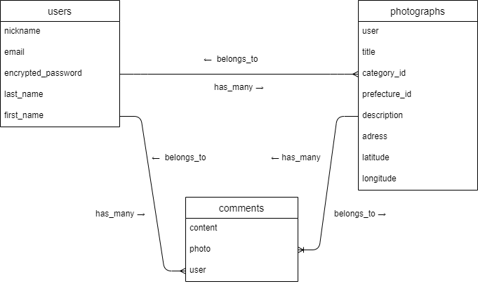

# アプリケーション名
Drive to Photograph

# アプリケーション概要
自分自身の愛車と風景の写真をブログ風にアップし、お互いにドライブ風景と愛車の写真を楽しむことが出来る。

# URL

# テスト用アカウント
・Basic認証パスワード:
・Basic認証ID:
・メールアドレス:
・パスワード:

# 利用方法

## 写真投稿
1. トップページのヘッダーからユーザー新規登録を行う
2. 投稿ボタンから、記事の編集（写真・タイトル・地域・天気・写真の内容）を入力し投稿する
3. マイページから自身が投稿した記事を修正、削除できる

## 他ユーザーを誉めあう
1. 一覧ページから他ユーザーの記事の詳細を確認する
2. 写真や記事が気に入ったら、コメントやいいねを行える

# アプリケーションを作成した背景
2020年のコロナ禍。今までの生活から一変する時代になった最中、幾ばくかの自由と新しいことへの挑戦としてバイクの免許を獲得した。ソロツーリングを謳歌する中、自身の愛車と風景を写真に収めていく。この写真を誰かと共有できないものだろうか、しかしさる雑誌やSMSの中では特段のオシャレやアレンジを加えたクラシックバイクが主体となっており、私のような一般バイク写真を共有するにはエリアが広すぎた。ならばそんなアプリを、そして仲間内でもオンラインでもと楽しめるアプリを作成したいと考えたアプリケーションとなりました。

# 洗い出した要件
https://docs.google.com/spreadsheets/d/1RBCA5S9ULs4cE_kDJA3BNF6mmsoD4lWubkE4_9Zp_Ys/edit?usp=sharing

# 実装した機能についての画像やGIFおよびその説明

# 実装予定の機能

# データベース設計

# 画面遷移図

# 開発環境
・フロントエンド
・バックエンド
・テスト
・タスク管理

# ローカルでの動作確認
以下のコマンドを順に実行

# 工夫したポイント
